# RSNA Workshop: MONAI on Amazon SageMaker

Welcome to the **MONAI on Amazon SageMaker** workshop at RSNA 2023!  In this workshop, you will learn how to use [MONAI](https://monai.io/), the Medical Open Network for Artificial Intelligence, on AWS.  You will have your own temporary AWS account, and we will be working through two MONAI workshops hosted on Jupyter notebooks on Amazon SageMaker, the fully managed service to prepare data and build, train, and deploy machine learning models.

Let's get started!

## Accessing your AWS account

Visit this link:

https://catalog.us-east-1.prod.workshops.aws/join?access-code=d5b0-066c6a-e6

* Choose **Email one-time password (OTP)**
* Enter your email and click **Send passcode**
* Check your email, and on the next page under **One-time email passcode**, enter the 9-digit code you received, and click **Sign in**
* On the **Review and join** page, review and agree to the terms and conditions, and click **Join event**
* On the **Event dashboard** screen, click **Open AWS console (us-east-1)** on the left hand sidebar.

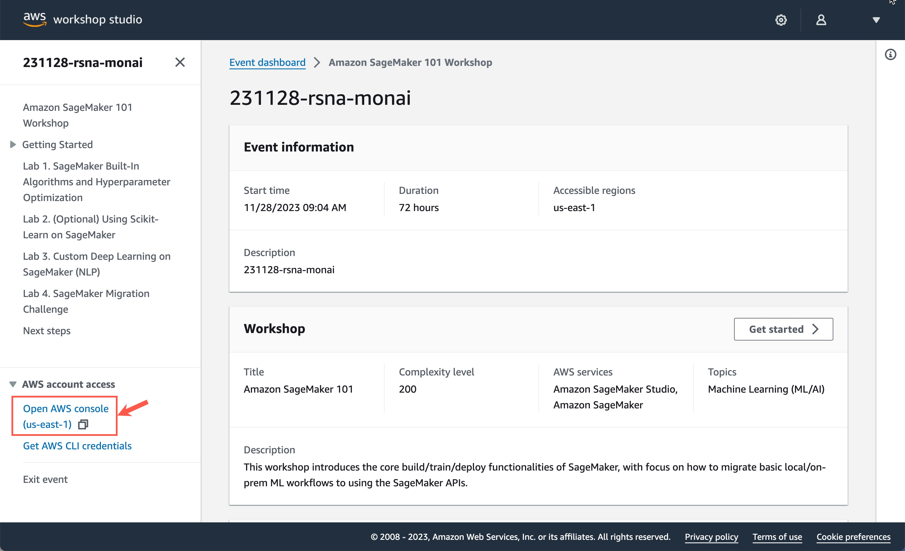

## Open Amazon SageMaker

You will now be on the AWS Console main page, from where you can access all AWS services.

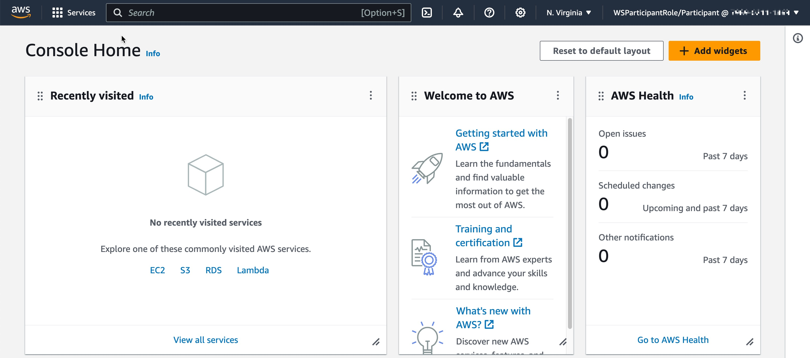

If **Amazon SageMaker** is visible as a link, click it.  Otherwise, you can locate it by typing 'Sagemaker' in the search bar.

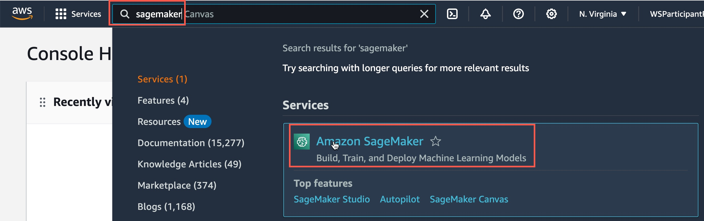

You will now be at the Amazon SageMaker main page.  A SageMaker Domain has been created for your use, so enter it by clicking on the Domain **PoCDomain**

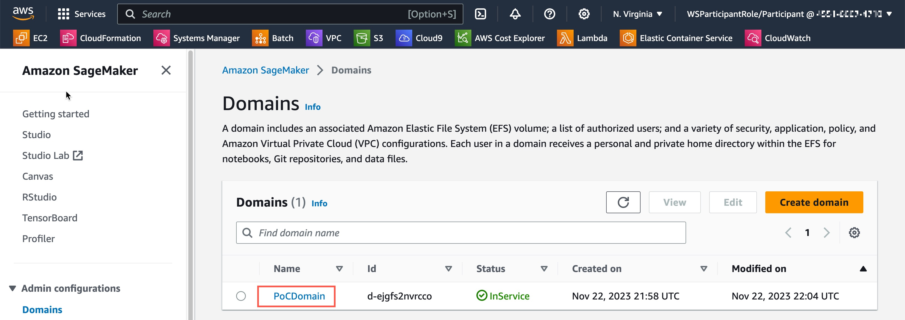

We will now open [SageMaker Studio](https://aws.amazon.com/sagemaker/studio/), the fully integrated development environment (IDE) for machine learning. 

On the SageMaker Domain details page, click on the **Launch** button and select **Studio** from the drop-down list.

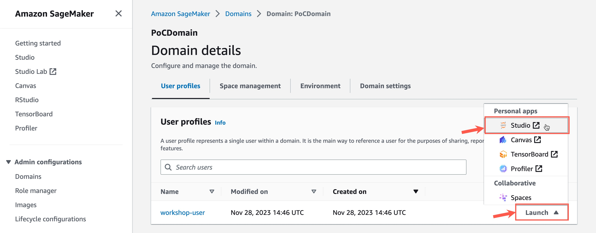

Note: If you see a popup that says 'Keep waiting', just wait a few more seconds.

## SageMaker Studio

Welcome to SageMaker Studio!  Amazon SageMaker Studio is an integrated development environment (IDE) that provides a single web-based visual interface where you can access purpose-built tools to perform all machine learning (ML) development steps, from preparing data to building, training, and deploying your ML models.

The first thing we will need to do is to clone the **MONAI Bootcamp** workshop from GitHub into our environment.
* Take a copy of this link to the workshop source:
  * `https://github.com/Project-MONAI/monai-bootcamp.git`
* Click the **Git** icon on the left sidebar
* Click **Clone a repository**
* Into the **Git repository URL**, paste the link you copied above
* Erase the value of **Project directory to clone into**
* Click **Clone**

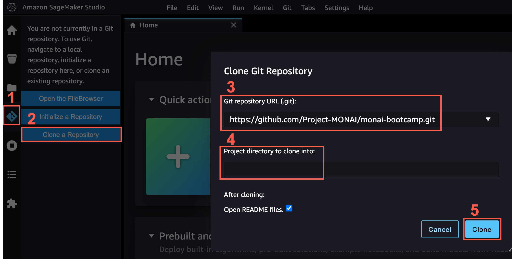

We are now in the File Browser, viewing the `README.md` file in the `monai-bootcamp` folder.  

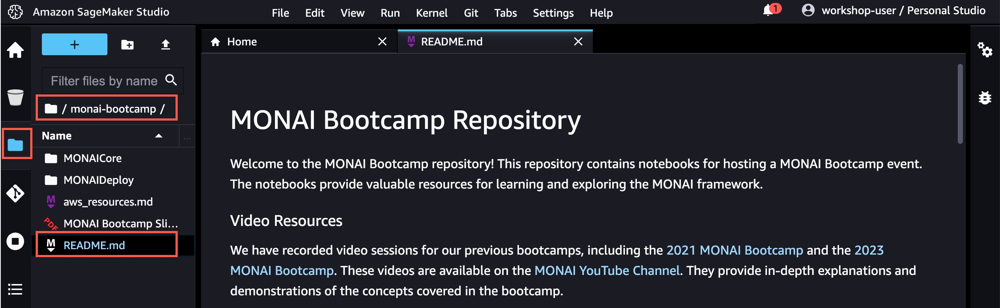

## Running a workshop

Open the first workshop, **MONAI end-to-end workflow**:
* In the file browser in the left toolbar, enter the `MONAICore` folder within `monai-bootcamp`
* Open the Jupyter Notebook file `MONAI End-to-End Workflow - Solution.ipynb`
  * NOTE: Ensure you open the notebook file with `Solution` in its name

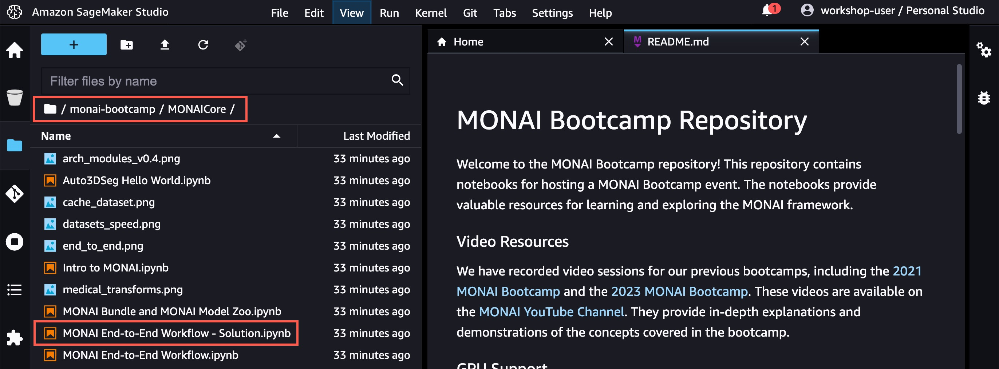

* Fill in the **Set up notebook environment** popup:
  * **Image**:
    * Select **PyTorch 2.0.1 Python 3.10 GPU Optimized**
    * Ensure you select **GPU** and not **CPU** Optimized
    * If selecting from the list, this option is toward the bottom of the list
    * Or, you can start typing **pytorch 2.0.1**, and then select the image
  * **Kernel**, **Instance type**, and **Start-up script** remain unaltered
    * The `ml.g4dn.xlarge` instance type used for this workshop has 4 vCPU, 16 GB RAM, and a 16 GB NVIDIA Tesla T4 GPU

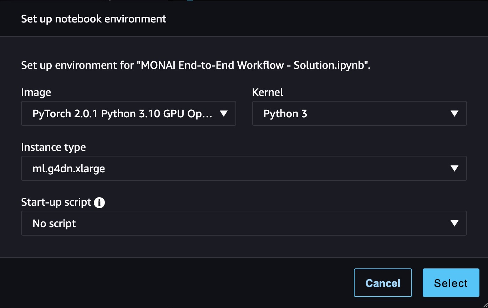

---

**Note: Allow up to 7 minutes for the notebook instance and its GPU to become available**

---

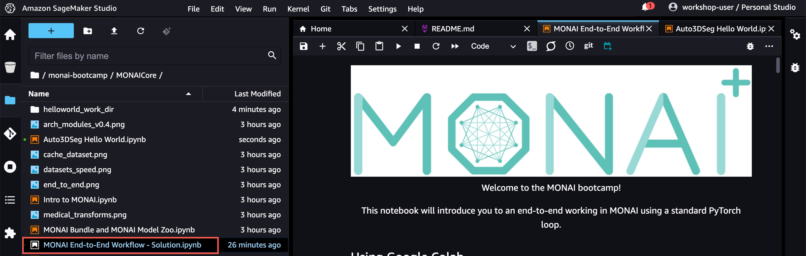

## Workshop 1: MONAI End-to-End Workflow

In this exercise, we will use the DenseNet-121 function through MONAI to train an image classification model, using images from the [MedNIST](https://github.com/apolanco3225/Medical-MNIST-Classification/blob/master/MedNIST.ipynb) dataset.  We will train the model on 8,000 images from each of 6 image classes: AbdomenCT, BreastMRI, CXR, ChestCT, Hand, HeadCT.  The trained model will be tested on a further 1,000 images from each class.

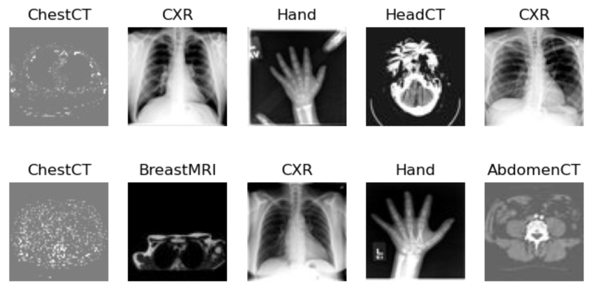

Follow the instructions in the Jupyter notebook to work through the workshop.  You can use the 'Play' icon in the menu bar to execute each cell in the notebook, or shift-Enter to execute the cell and advance.

Cells containing text will execute instantly.  Cells containing code will execute that code, and display `[*]:` while they are running.  Some cells take longer: Installing MONAI will take 1-2 minutes, and the **Network Training** cell will take around 2.5 minutes per epoch.  For faster (though less accurate) results, you can reduce the number of training epochs in this cell from 4 to 2 or 3.

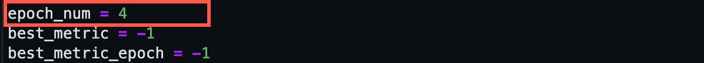

## Workshop 2: Auto3DSeg

In this exercise, we will use the MONAI [Auto3DSeg](https://github.com/Project-MONAI/tutorials/tree/main/auto3dseg) solution to train a model to segment a set of synthetic images in Nifti format. The model will be trained on 24 images, and tested on a further 8.

Repeat the process in **Running a workshop** above, this time running the Jupyter notebook file `Auto3DSeg Hello World.ipynb` in the same folder (`monai-bootcamp/MONAICore`).  Use the same values as before for the notebook environment.

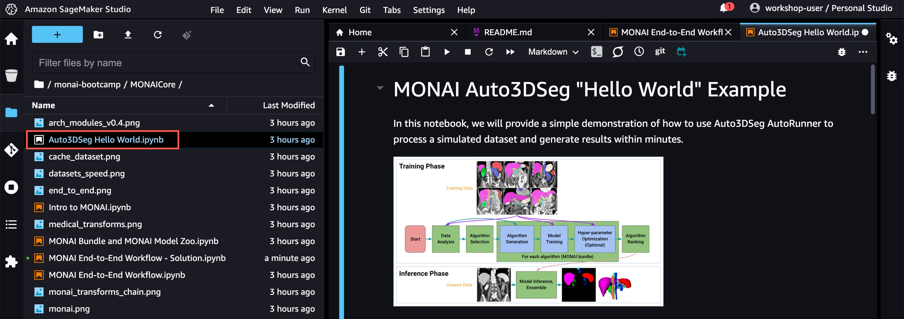

**Note**: We will need to modify the code cell of **0.1 Installation**, to import the pip module `fire`. Before executing this cell, add this line to the cell's contents:

```
!python -c "import fire" || pip install -U "fire"
```

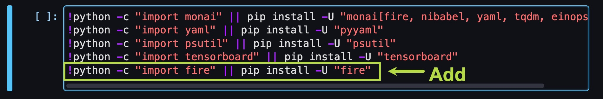

You can now proceed to run all remaining cells in the notebook.